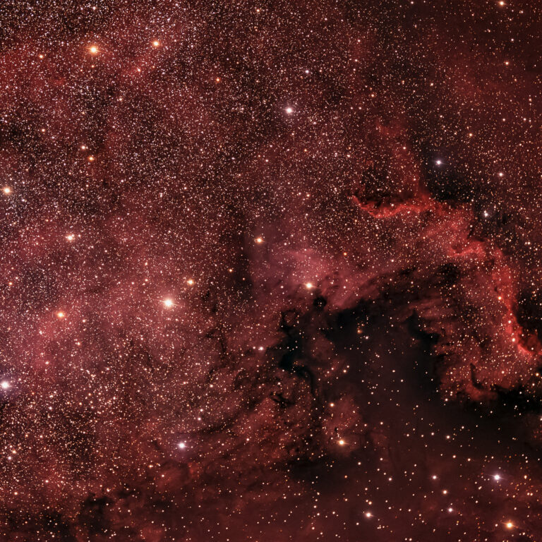
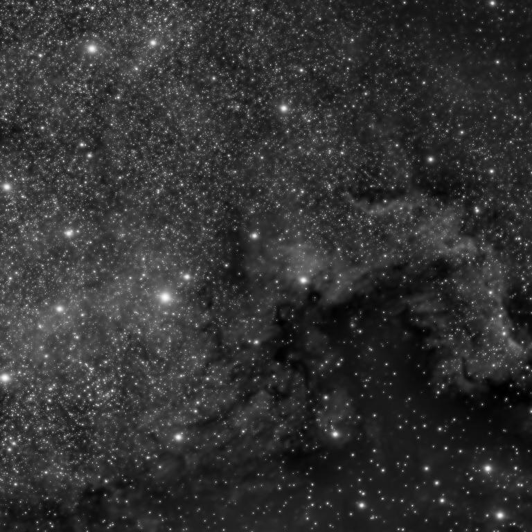

# Wega - Multi-Scale Image Analysis

This application can be used to transform images into multiple signals. For example, for space images, the image is split into layers containing small scale background structures like small stars, medium scale structures like the arms of a galaxy and large scale structures like the core of a galaxy.

By applying the noise reduction to the small scale layers only, the visual noise of the image is reduced but the details of bigger structures still remain.

|  Original unfiltered image |  Filtered and noise reduced image|
|:-:|:-:|

---
Tested photo is from Stephen Rahn. It was released with a CC0 license [here](https://negativespace.co/sky-starry-background/).
